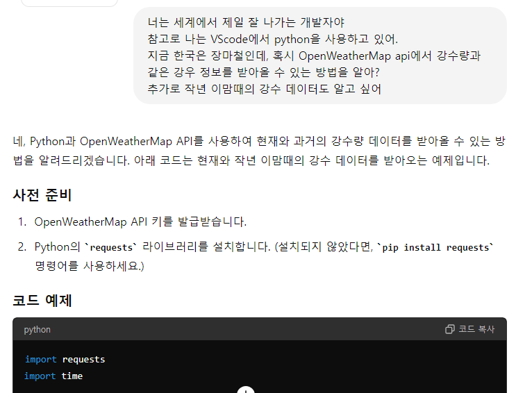
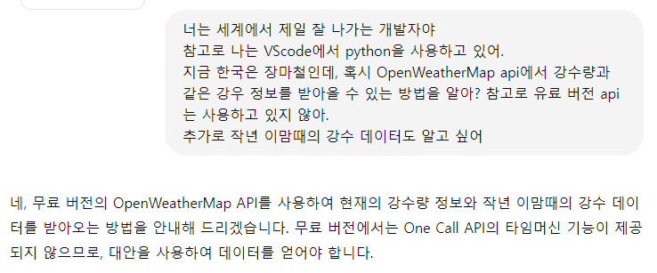
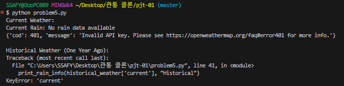

# pjt-01 (금융)
## 01-pjt
- **새로 배운 점**  
  - requests를 통해 외부 API를 이용해 데이터를 받고, 가공하는 법을 배웠습니다.
  
- **어려웠던 점**
  - 없음.
  
- **느낀 점**
  - 받아온 데이터의 타입이 dict이기 때문에, .keys(), .values()와 같은 dict 전용 매서드가 사용 가능하다는 점을 느꼈습니다.
## 02-pjt
- **새로 배운 점**
  - dict의 value를 다른 dict의 value에 할당하는 법을 배웠습니다.  
  
- **어려웠던 점**
  - 없습니다.  
  
- **느낀 점**
  - dict는 순서가 없어서 출력이 다르게 되지 않을까 생각했는데, key에 따라 오름차순으로 출력돼 동일한 결과가 나왔다.
  - 아마도 순서는 없음에도 오름차순으로 정렬되어 출력되도록 보이게 설정돼 있지 않을까 생각이 들었습니다.

## 03-pjt
- **새로 배운 점**
  - dict의 key 값을 바꾸는 방법을 배웠습니다.  
  
- **어려웠던 점**
  - 제가 구현한 방법처럼 한 땀 한 땀 구현하는 방법 말고, for문 등을 활용한 방법이 있을 것 같다는 생각이 들었는데, 구현하지 못했습니다.  
  
- **느낀 점**
  - 구현은 되었지만, 더 짧고 효율적인 구현 방법을 찾아봐야겠다는 생각이 들었습니다.
  - '날씨' key의 value 값에 리스트를 삽입하는 과정이 매끄럽지 못하다는 생각이 들어 다른 방법을 찾아봐야겠다는 생각이 들었습니다.

## 04-pjt
- **새로 배운 점**
  - dict에 새로운 key - value 쌍을 추가하는 방법을 다시 한 번 떠올릴 수 있었습니다.
  - round() 함수를 사용해, 반올림 및 자릿수 표시하는 방법을 배웠습니다.  
  
- **어려웠던 점**
  - 없습니다.  
  
- **느낀 점**
  - 반올림 없이 소수점 자리를 자르는 방법을 찾아봐야겠다는 생각이 들었습니다.

## 05-pjt
- **프롬프트 화면 캡쳐**
  - 첫 프롬프트
  

  - 무료 버전 조건을 추가한 프롬프트  
  
  

- **Code**
  ```python
  import requests
  import time

  API_KEY = 'd041d5b2deed53c8decf301f3fbadcb3'  # OpenWeatherMap API 키를 입력하세요.
  CITY = 'Seoul,KR'
  LAT = 37.5665  # 서울의 위도
  LON = 126.9780  # 서울의 경도

  def get_current_weather(api_key, city):
      url = f'http://api.openweathermap.org/data/2.5/weather?q={city}&appid={api_key}'
      response = requests.get(url)
      data = response.json()
      return data

  def get_historical_weather(api_key, lat, lon, dt):
      url = f'http://api.openweathermap.org/data/2.5/onecall/timemachine?lat={lat}&lon={lon}&dt={dt}&appid={api_key}'
      response = requests.get(url)
      data = response.json()
      return data

  def print_rain_info(data, time_period):
      if 'rain' in data:
          print(f"{time_period} Rain (1h): {data['rain'].get('1h', 'No data')} mm")
          print(f"{time_period} Rain (3h): {data['rain'].get('3h', 'No data')} mm")
      else:
          print(f"{time_period} Rain: No rain data available")

  # 현재 날씨 데이터 가져오기
  current_weather = get_current_weather(API_KEY, CITY)
  print("Current Weather:")
  print_rain_info(current_weather, "Current")

  # 작년 이맘때의 Unix timestamp 계산하기
  current_time = int(time.time())
  one_year_ago = current_time - 365 * 24 * 60 * 60

  # 작년 이맘때의 날씨 데이터 가져오기  
  historical_weather = get_historical_weather(API_KEY, LAT, LON, one_year_ago)
  print(historical_weather)
  print("\nHistorical Weather (One Year Ago):")
  print_rain_info(historical_weather['current'], "Historical")
  ```
  
- **실행 결과**
  
  
- **새로 배운 점**
  - 생성형 AI의 효율성  
  
- **어려웠던 점**
  - 완벽하게 작동하지 않는 코드의 모습을 보면서 문제점을 찾는 과정이 어려웠습니다.  
  
- **느낀 점**
  - 복잡하고 긴 코드를 순식간에 짜는 모습을 보며 GPT와 같은 생성형 AI의 힘을 다시 한 번 더 느꼈습니다. 
  - 이처럼 강력한 생성형 AI를 적절히 사용할 수 있다면 개발의 능률 향상에 큰 도움이 될 것 같다는 생각이 들었습니다.
  - 하지만 무료 버전에서는 지원하지 않는 기능을 추천하는 모습을 보면서 프롬프트를 입력할 때 더욱 상세히 입력해야겠다는 생각을 하였습니다.