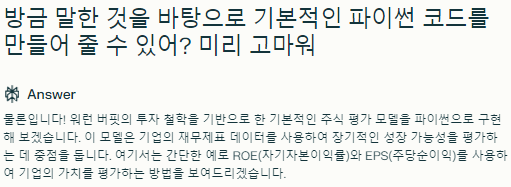

## 01-pjt
### 새로 배운 점
- Numpy를 활용해 csv 파일을 여는 방법을 배웠습니다.
- Pandas를 활용해 데이터 구조를 만드는 법을 배웠습니다.
- 배열의 특정 열만 조회하는 방법을 배웠습니다

### 어려웠던 점
- 파일을 여는 과정이 상당히 복잡하게 느껴졌습니다.
  - 꾸준히 따로 실습하면서 익숙하게 만들 예정입니다.
- 특정 범위를 지정할 때 복잡하게 느껴졌습니다.
  - 아무래도 python list등의 인덱스 등에 익숙해져서 그런 것 같습니다.  
    실습을 통해 익숙해지도록 하겠습니다.

### 느낀 점
- 항상 Python과 VsCode를 활용해 단순 수학 공식 계산 등만을 해 왔는데, 이렇게 눈에 보이는 것을 구현할 수 있다는 점에서 즐거움을 느꼈습니다.
- 하지만 아직까지 숙련도가 너무나 낮은 관계로 시간이 오래걸렸던 만큼 꾸준히 연습하며 제 것으로 만들어볼 계획입니다.
  
## 02-pjt
### 새로 배운 점
- Pandas를 활용해 파일을 가져오고 여는 법을 배웠습니다
- Matplotlib을 활용해 데이터를 시각화하는 법을 배웠습니다.
- to_datetime 함수를 활용해 날짜 데이터를 필터링이 가능한 형식으로 바꾸는 법에 대해서 배웠습니다.
- 가독성을 위해서 X축 라벨을 돌리는 등의 수정 작업에 대해서 배웠습니다.

### 어려웠던 점
- 구현에 성공하긴 했지만, to_datetime 함수의 작동 원리에 대해서 아직 이해가 부족하다고 생각합니다.
  - 다양한 실습을 통해서 정확히 어떤 작업을 만들어내는지 확인해 볼 계획입니다.
- 특정 날짜 필터링 과정에 많은 시간이 걸렸습니다.
  - 다음에 할 때에는 훨씬 짧은 시간 안에 할 수 있을 것으로 기대하고 있습니다.

### 느낀 점
- 1번 도전과제와 마찬가지로 항상 Python과 VsCode를 활용해 단순 수학 공식 계산 등만을 해 왔는데, 이렇게 눈에 보이는 것을 구현할 수 있다는 점에서 즐거움을 느꼈습니다.
- 제가 사용한 것 보다 훨씬 많은 함수가 존재하는 것을 느꼈고, 더 많이 배워야겠다는 생각을 하게 되었습니다.

## 03-pjt
### 새로 배운 점
- 특정 필드의 최대값, 최소값을 출력하는 방법에 대해 배웠습니다.

### 어려웠던 점
- 없습니다.

### 느낀 점
- 파이썬의 기본 내장 함수와 유사하다고 느꼈으면서도, 배치하는 위치 등이 다른 것 등의 차이가 존재했기에 헷갈린다고 느꼈던 부분이 존재했습니다.
- 잘 활용한다면 훨씬 편리하고 강력하게 자료 정리 등을 할 수 있을 것이라 느꼈습니다.

## 04-pjt
### 새로 배운 점
- groupby, grouper 등을 활용해 데이터를 특정 단위별로 그룹화 하는 법을 배웠습니다.
- 월 별로 그룹화 하는 것 말고도, 특정 일수, 연도 별로 분류하는 법도 배웠습니다.
- reset_index를 활용해 인덱스 열을 되살리고 헤더의 행을 맞추는 법을 배웠습니다.
- 평균을 구하는 함수에 대해서 배웠습니다.

### 어려웠던 점
- grouper를 사용했을 때 헤더의 행이 맞지 않아 그래프 생성시 열을 불러오는데에 문제를 겪었습니다.
  - reset_index를 활용해 헤더의 행을 맞춰서 해결하였습니다.

### 느낀 점
- 데이터를 특정 조건 별로 분류하는 과정을 통해 더 편리하고 강력하게 자료 정리 등을 할 수 있을 것이라 생각했습니다.
  
## 05-pjt
### 새로 배운 점
- 여러 개의 데이터를 한 그래프 내에 표현하는 방법에 대해서 배웠습니다.
- 필드에 라벨을 추가하고, 범례를 표시하는 방법에 대해서 배웠습니다.

### 어려웠던 점
- 없었습니다.

### 느낀 점
- 제가 따로 지정하지 않아도 그래프에 스타일이 적용돼서 편했습니다.
- 잘 활용한다면 데이터를 분석하는데에 큰 도움이 될 것이라고 생각했습니다.

## 06-pjt
### 첫 프롬프트

### 두번째 프롬프트

### 세번째 프롬프트

### 새로 배운 점
- 우문이었음에도 현답하는 생성형 AI를 보면서 생성형 AI가 가진 혜안에 대해서 생각해볼 수 있었습니다.

### 어려웠던 점
- 없었습니다.
  
### 느낀 점
- 우문이었음에도 현답하는 생성형 AI를 보면서 생성형 AI가 가진 혜안에 대해서 생각해볼 수 있었습니다.
- 어렵다고 하면서도 코드를 결국 짜서 주는 생성형 AI의 능력에 대해서 놀랐습니다.